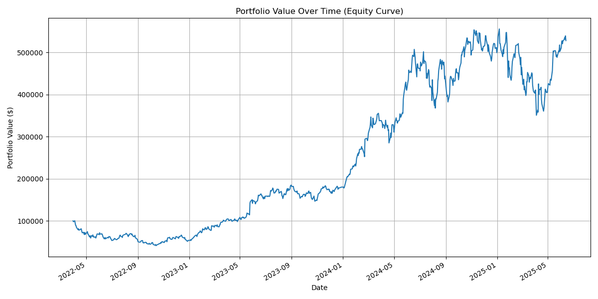
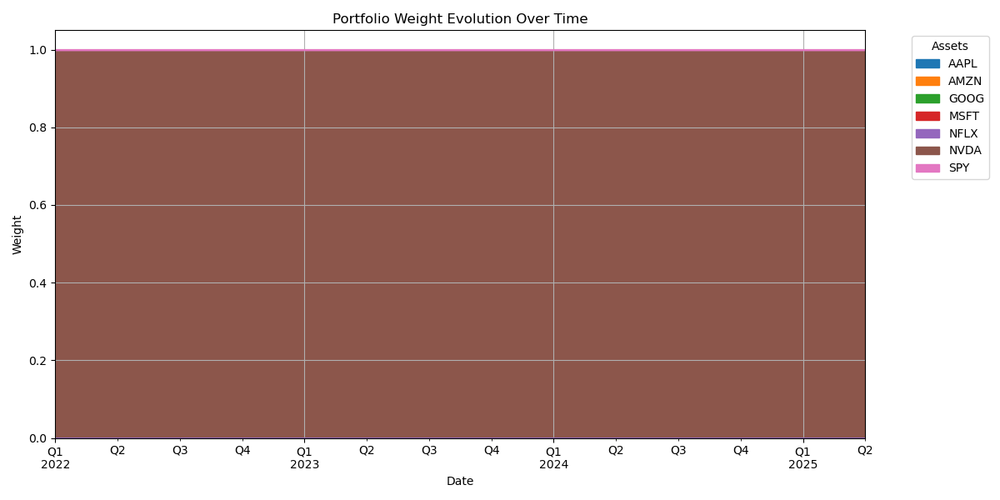
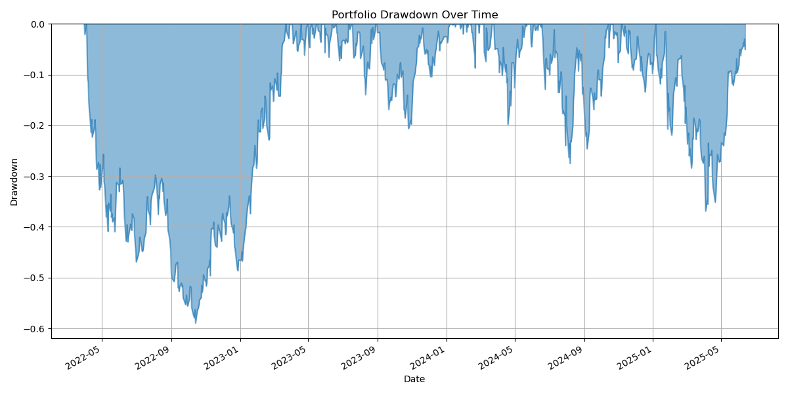
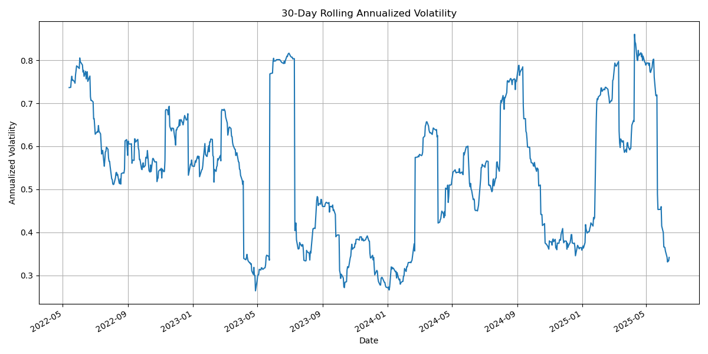

# Portfolio Optimization and Backtesting Analysis

This project provides a comprehensive pipeline for portfolio optimization and historical simulation. It is designed to find an optimal portfolio based on historical returns and then simulate its performance over the same period.

## Key Features

- **Data Caching**: Caches historical stock data locally to accelerate subsequent runs. The data is fetched from an external source and saved as `generated_output/portfolio_data.pkl`.
- **Portfolio Optimization**: Utilizes Modern Portfolio Theory (MPT) to find the optimal portfolio allocation that maximizes the Sharpe ratio, based on historical data.
- **Historical Simulation**: Simulates the performance of the optimized portfolio over the historical data period, including periodic rebalancing.
- **Advanced Visualization**: Generates and saves a suite of plots to the `plots/` directory, including:
  - Portfolio Value Over Time
  - Portfolio Drawdown
  - Distribution of Monthly Returns
  - 30-Day Rolling Volatility
  - Asset Correlation Matrix
- **Configurability**: Key parameters such as the initial investment and risk-free rate can be adjusted in the `config.py` file.
- **Logging**: Captures detailed execution information in `logs/portfolio_analysis.log`.

## Project Structure

```
.
├── plots/                 # Saved visualizations
├── logs/                  # Log files
├── generated_output/      # Directory for cached data
│   └── portfolio_data.pkl # Cached financial data
├── README.md
├── config.py              # Main configuration file
├── main.py                # Main script to run the pipeline
├── portfolio_optimizer.py # Handles portfolio optimization
├── portfolio_simulator.py # Handles historical simulation (backtesting)
└── portfolio_plotter.py   # Handles plotting and visualization
```

## Installation

1.  **Set up the environment:**
    It is highly recommended to use a virtual environment.
    ```bash
    python -m venv venv
    source venv/bin/activate  # On Windows, use `venv\Scripts\activate`
    ```
2.  **Install dependencies:**
    The project requires several libraries. You can install them using pip:
    ```bash
    pip install pandas numpy matplotlib seaborn scipy
    ```
    *(Note: A `requirements.txt` file can be generated with `pip freeze > requirements.txt`)*

## How to Run

1.  **Ensure you have data**: Place your cached data file at `generated_output/portfolio_data.pkl`. This file should be a pandas DataFrame containing the historical price data for your selected assets.
2.  **(Optional) Customize parameters** in `config.py`. You can adjust settings like the initial investment value.
3.  **Run the main script** from your terminal:
    ```bash
    python main.py
    ```

## Output

After running the script:
-   **Console**: You will see the final backtest performance metrics printed to the console.
-   **Plots**: All charts will be saved as PNG files in the `plots/` directory.
-   **Logs**: The full execution log is saved in the `logs/` directory.

## Example Visualizations

Below are examples of the plots generated by the analysis.

**Portfolio Performance (Equity Curve)**


**Portfolio Weight Evolution**


**Drawdown**


**Rolling Volatility**


---

### A Note on the Approach

This tool performs optimization based on *historical* data. The "optimal" portfolio it generates is optimal for that specific historical period only. It is not a prediction of future performance. The simulation is a backtest showing how that single, statically optimized portfolio would have performed.

The results, such as the 100% allocation to a single stock in the example run, are common in historical analyses where one asset has overwhelmingly outperformed others. This does not constitute financial advice, and such a concentrated portfolio would be considered extremely high-risk in a real-world scenario. 